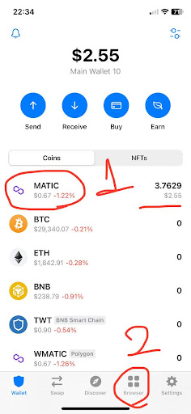
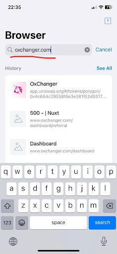
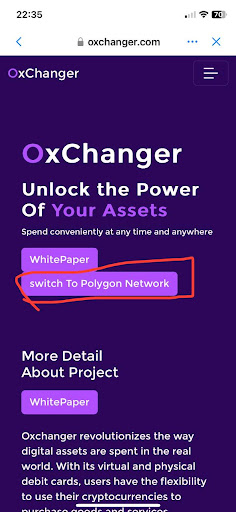
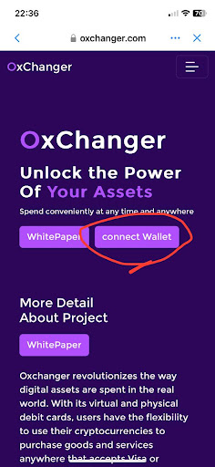
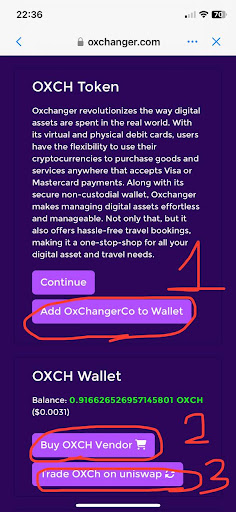
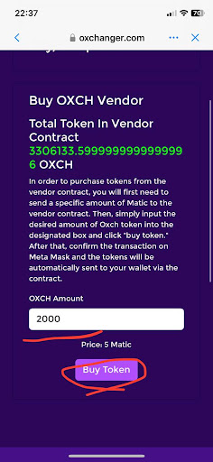
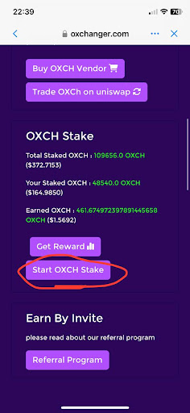
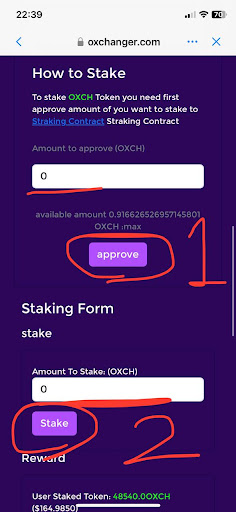
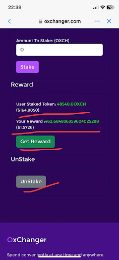

# How to Use Cryptocurrency Staking

## What is Cryptocurrency Staking?

Token staking is the process of locking up a certain amount of cryptocurrency tokens or coins in a digital wallet to support the operations of a blockchain network. By staking tokens, users become validators or delegators, allowing them to participate in the consensus mechanism and earn rewards.

The staking process involves holding a minimum balance of tokens as proof of ownership and commitment to the network. These tokens are then locked in a smart contract or staking pool for a predetermined period of time, used to validate transactions and secure the network.

Validators propose and validate new blocks, securing the blockchain and earning rewards through mechanisms like block rewards and transaction fees. Delegators stake their tokens with validators and earn a share of the rewards based on the amount staked.

Token staking helps secure the network, encourages active participation in the blockchain ecosystem, provides a way to earn passive income, and promotes decentralization by involving more participants in the consensus process.

## How OXCH Token Calculates Staking Rewards

OXCH uses the Synthetix Staking Rewards Contract, allowing users to earn rewards by staking their OXCH tokens. Staking contributes to securing the OxChangerToken network and maintaining its stability. Rewards are calculated based on the amount of OXCH staked and the stake duration, with longer stakes earning more rewards. Rewards are distributed proportionally among all stakers.

## How to Start Staking OXCH

1. Install a Web3 Wallet on your smartphone. We recommend Trustwallet.

   

2. Open Trustwallet and create a wallet.

3. Make sure you own some Polygon Matics. If not, buy them from a reputable exchange like Changelly or Binance.

   

4. Click the "Browser" button in the Trustwallet menu.

   

5. Type the website link and click enter. If not registered, join using the referral
   link: [https://www.oxchanger.com/join/HF81QVSnHsLGCSih](https://www.oxchanger.com/join/HF81QVSnHsLGCSih)

6. Change your wallet network to the "polygon" network by clicking the "Switch to Polygon Network" button.

   

7. Click the "Connect Wallet" button.

   

8. Add OXCH Token to your wallet.

   

9. Use the vendor contracts to buy OXCH tokens.

   

10. Navigate to the dashboard and scroll to the staking section.

    

11. Click the "Start OXCH Stake" button.

    

12. Approve the staking amount and click "Stake" to stake your tokens.

13. You can view and collect your rewards at any time. Use the "unstake" button to collect all your OXCH.

    

Congratulations! You have successfully started staking OXCH tokens.
